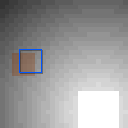
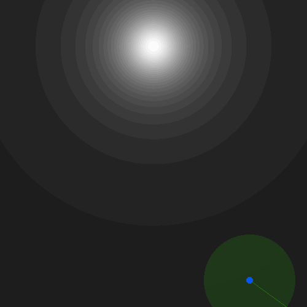
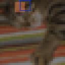

# Active Perception Gym

Extension of [Gymnasium](https://github.com/Farama-Foundation/Gymnasium/) for active perception tasks.

## Installation

This package can be installed using pip:

```bash
pip install ap_gym[OPTIONS]
```

where OPTIONS can be empty or `examples`, which installs dependencies for the examples.

## Basic Usage

_ap_gym_ adds functionality for active perception tasks to Gymnasium.
This guide assumes that you are familiar with Gymnasium, otherwise, please check out their [documentation](https://gymnasium.farama.org/index.html).

### Active Perception

In the active perception domain, an agent's main objective is to gather information and make predictions about a desired property of the environment.
Examples of such properties could be the location of an object in case of a search task or the class of an object the agent in case of a classification task.
To gather information, the agent must interact with the environment, e.g. by moving a glimpse around in case of the [CircleSquare](doc/CircleSquare) and [MNIST](doc/MNIST) tasks.

_ap_gym_ models active perception tasks as episodic processes in a way that is fully compatible to Gymnasium.
Each task is defined as a Gymnasium environment, in which the agent is additionally provided with a differentiable loss function.
The purpose of the loss function is to provide the agent with a generalizable notion of the distance between its current property prediction and the ground truth property.

In every episode, the agent may take a task-dependent number of steps to gather information.
Just like in Gymnasium, in every step the environment provides the agent with an observation, typically consisting of scalar and/or image data.
In return, the agent must provide the environment with an action and a property prediction in every step.
Based on the action and prediction of the agent, the environment computes a reward in every step, which is the sum of a regular RL reward (the base reward) and the negative value of the environment's loss function.
Hence, the agent has to make a prediction in every step, encouraging it to gather information quickly to maximize its prediction reward early on.

### Environment Base Classes

Every task in _ap_gym_ is modeled as a subclass of `ap_gym.ActivePerceptionEnv` or `ap_gym.ActivePerceptionVectorEnv`.
`ap_gym.ActivePerceptionEnv` and `ap_gym.ActivePerceptionVectorEnv` subclass `gymnasium.Env` and `gymnasium.vector.VectorEnv`, respectively.
Both subclasses extend their Gymnasium interfaces by four fields:
- `loss_fn`: The loss function of the environment. See [`ap_gym.LossFn`](#ap_gymlossfn).
- `prediction_space`: A `gymnasium.spaces.Space` defining the set of valid prediction values.
- `prediction_target_space`: A `gymnasium.spaces.Space` defining the set of valid prediction target values.
- `inner_action_space`: A `gymnasium.spaces.Space` defining the set of valid inner action values.
Additionally, `ap_gym.ActivePerceptionVectorEnv` adds the respective single variants of the latter two fields: `single_prediction_space` and `single_inner_action_space`.

`ap_gym.ActivePerceptionEnv` and `ap_gym.ActivePerceptionVectorEnv` further enforce the agent's action space to be of the following form:
```python
{
    "action": action,
    "prediction": prediction
}
```
where the set of valid `action` values is defined by the `inner_action_space` field of the respective environment, and the set of valid `prediction` values is defined by the `prediction_space` field.

The info dictionary returned by the reset and step functions always contains the current prediction target in `info["prediction"]["target"]`.
Additionally, the info dictionary returned by the step function contains the base reward (the reward without the prediction loss) in `info["base_reward"]` and the prediction loss in `info["prediction"]["loss"]`.

To get an understanding of how this class is used, refer to the examples in the _examples_ directory and to the [tasks](#tasks) defined by _ap_gym_.

### Loss Functions
The `ap_gym.LossFn` base class provides a differentiable implementation of the loss function for PyTorch and JAX.
`ap_gym.LossFn` has three functions: `numpy`, `torch`, and `jax`.
Each of these functions is the respective implementation of the loss function in Numpy, PyTorch, and JAX.
Note that only the PyTorch and JAX variant provide gradients as Numpy does not support autograd.

The signature of each framework-specific function is
```python
def fn(prediction: ArrayType, target: ArrayType, batch_shape: Tuple[int, ...] = ()) -> ArrayType:
    ...
```
where ArrayType is one of `np.ndarray`, `torch.Tensor`, or `jax.Array`.
`batch_shape` is used to specify the batch dimensions in case of a batched evaluation of the loss function, e.g.:

```python
loss = ap_gym.CrossEntropyLossFn()(np.zeros((3, 7, 10)), np.zeros((3, 7), dtype=np.int_), (3, 7))
```

### Representation of Image Observations

To help the agent differentiate between scalar and image observations, _ap_gym_ introduces a new type of Gymnasium space: `ap_gym.ImageSpace`.
`ap_gym.ImageSpace` is a subclass of `gymnasium.spaces.Box` with some image specific convenience properties like `width`, `height`, and `channels`.
Its main purpose, though, is to let the agent know that it has to interpret this part of the observation space as an image.

### Using Gymnasium Wrappers
_ap_gym_ provides a method for using regular Gymnasium wrappers on `ap_gym.ActivePerceptionEnv` and `ap_gym.ActivePerceptionVectorEnv` instances.
The issue with using Gymnasium wrappers naively is that the special fields `loss_fn`, `prediction_space`, `prediction_target_space`, and `inner_action_space` do not get mapped through.
Hence,
```python
gymnasium.wrappers.TimeLimit(ap_gym.make("CircleSquare-v0"), 8).loss_fn
```
throws
```
AttributeError: 'TimeLimit' object has no attribute 'loss_fn'
```

To address this issue, `ap_gym.ensure_active_perception_env` and `ap_gym.ensure_active_perception_vector_env` can be used:
```python
ap_gym.ActivePerceptionRestoreWrapper(gymnasium.wrappers.TimeLimit(ap_gym.make("CircleSquare-v0"), 8)).loss_fn
```
`ap_gym.ActivePerceptionRestoreWrapper` and `ap_gym.ActivePerceptionVectorRestoreWrapper` recursively traverse wrappers until they find an active perception environment and map the special fields through.
Additionally, aside of Gymnasium wrappers, `ap_gym.ActivePerceptionVectorRestoreWrapper` also supports `gymnasium.vector.SyncVectorEnv` and `gymnasium.vector.AsyncVectorEnv` and will restore proper vector versions of all spaces if active perception environments are vectorized this way.

### Environments

TODO: document test environments
TOOD: document other environments (light dark, cifar10, TinyImageNet)

_ap_gym_ currently comes with a number of image classification environments, which are described in detail in the [image classification documentation](doc/ImageClassification).

<table align="center" style="border-collapse: collapse; border: none;">
    <tr style="border: none;">
        <td align="center" style="border: none; padding: 10px;">
            <a href="doc/CircleSquare.md">
                
                <br/>
                CircleSquare-v0
            </a>
        </td>
        <td align="center" style="border: none; padding: 10px;">
            <a href="doc/MNIST.md">
                
                <br/>
                MNIST-v0
            </a>
        </td>
        <td align="center" style="border: none; padding: 10px;">
            <a href="doc/LightDark.md">
                
                <br/>
                LightDark-v0
            </a>
        </td>
        <td align="center" style="border: none; padding: 10px;">
            <a href="doc/TinyImageNet.md">
                
                <br/>
                TinyImageNet-v0
            </a>
        </td>
        <td align="center" style="border: none; padding: 10px;">
            <a href="doc/CIFAR10.md">
                
                <br/>
                CIFAR10-v0
            </a>
        </td>
    </tr>
</table>


### Converting Regular Gymnasium Environments to Active Perception Environments

It is possible to convert regular Gymnasium environments into a pseudo active perception environments with the `ap_gym.PseudoActivePerceptionWrapper` and `ap_gym.PseudoActivePerceptionVectorWrapper`, respectively:
```python
env = gymnasium.make("CartPole-v1")
ap_env = ap_gym.PseudoActivePerceptionWrapper(env)
```
`ap_gym.PseudoActivePerceptionWrapper` and `ap_gym.PseudoActivePerceptionVectorWrapper` take the environment and add a constant zero loss function as well as empty prediction and prediction target spaces.
The purpose of this conversion is to simplify testing of _ap_gym_ compatible algorithms on regular Gynmasium tasks.

If you want to support arbitrary Gymnasium and _ap_gym_ environments, use the `ap_gym.ensure_active_perception_env` and `ap_gym.ensure_active_perception_vector_env` functions:
```python
ap_env_1 = ap_gym.ensure_active_perception_env(gymnasium.make("CartPole-v1"))
ap_env_2 = ap_gym.ensure_active_perception_env(ap_gym.make("CircleSquare-v0"))
ap_env_3 = ap_gym.ensure_active_perception_env(gymnasium.wrappers.TimeLimit(ap_gym.make("CircleSquare-v0"), 8))
```
These functions automatically detect whether to do nothing, apply a restoration wrapper, or perform pseudo active perception environment conversion.

## Advanced Usage

This section describes some more advanced usage of _ap_gym_, namely creating custom environments and wrappers.

### Defining Own Environments

Implementing custom environments entails subclassing `ap_gym.ActivePerceptionEnv` or `ap_gym.ActivePerceptionVectorEnv`.
An example implementation could look like this:

```python
from typing import Any

import numpy as np
import gymnasium as gym
import ap_gym


# Generic arguments are 
# ObsType: Type of the observation
# ActType: Type of the action
# PredType: Type of the prediction
# PredTargetType: Type of the prediction target

class MyCustomEnv(ap_gym.ActivePerceptionEnv[np.ndarray, np.ndarray, np.ndarray, int]):
    def __init__(self):
        self.observation_space = ap_gym.ImageSpace(width=5, height=5, channels=1)
        inner_action_space = gym.spaces.Box(-1.0, 1.0, shape=(2,), dtype=np.float32)
        prediction_space = gym.spaces.Box(-np.inf, np.inf, shape=(10,), dtype=np.float32)
        self.action_space = ap_gym.ActivePerceptionActionSpace(inner_action_space, prediction_space)
        self.prediction_target_space = gym.spaces.Discrete(10)
        self.loss_fn = ap_gym.CrossEntropyLossFn()
        self._current_class = None

    def _reset(
            self, *, seed: int | None = None, options: dict[str, Any | None] = None
    ) -> tuple[np.ndarray, dict[str, Any], int]:
        self._current_class = ...  # Randomly choose a class
        obs = ...  # Generate the initial observation
        info = ...  # Additional information
        return obs, info, self._current_class

    def _step(
            self, action: np.ndarray, prediction: np.ndarray
    ) -> tuple[np.ndarray, float, bool, bool, dict[str, Any], int]:
        obs = ...  # Generate the next observation
        base_reward = ...  # Compute the base reward (the loss function will be evaluated by ap_gym.ActivePerceptionEnv)
        terminated = ...  # Whether the episode is terminated
        truncated = ...  # Whether the episode is truncated
        info = ...  # Additional information
        self._current_class = ...  # The prediction target may change over time
        return obs, base_reward, terminated, truncated, info, self._current_class
```

If you wish to see a full example, check out the [LightDark](doc/light_dark.md) [implementation](ap_gym/envs/light_dark.py).

For vectorized environments, subclass `ap_gym.ActivePerceptionVectorEnv` instead:

```python
from typing import Any

import numpy as np
import gymnasium as gym
import ap_gym


# Generic arguments are
# ObsType: Type of the observation
# ActType: Type of the action
# PredType: Type of the prediction
# PredTargetType: Type of the prediction target
# ArrayType: Type of the arrays (typically np.ndarray)

class MyCustomVectorEnv(ap_gym.ActivePerceptionVectorEnv[np.ndarray, np.ndarray, np.ndarray, int, np.ndarray]):
    def __init__(self, num_envs: int):
        self.num_envs = num_envs
        
        self.single_observation_space = ap_gym.ImageSpace(width=5, height=5, channels=1)
        single_inner_action_space = gym.spaces.Box(-1.0, 1.0, shape=(2,), dtype=np.float32)
        single_prediction_space = gym.spaces.Box(-np.inf, np.inf, shape=(10,), dtype=np.float32)
        self.single_action_space = ap_gym.ActivePerceptionActionSpace(
            single_inner_action_space,
            single_prediction_space
        )
        self.single_prediction_target_space = gym.spaces.Discrete(10)
        
        self.observation_space = gym.vector.utils.batch_space(self.single_observation_space, num_envs)
        self.action_space = gym.vector.utils.batch_space(self.single_action_space, num_envs)
        self.prediction_target_space = gym.vector.utils.batch_space(self.single_prediction_target_space, num_envs)
        
        self.loss_fn = ap_gym.CrossEntropyLossFn()
        self._current_classes = None

    def _reset(
            self, *, seed: int | None = None, options: dict[str, Any | None] = None
    ) -> tuple[np.ndarray, dict[str, Any], int]:
        self._current_class = ...  # Randomly choose classes (now an array)
        obs = ...  # Generate the initial observation
        info = ...  # Additional information
        return obs, info, self._current_class

    def _step(
            self, action: np.ndarray, prediction: np.ndarray
    ) -> tuple[np.ndarray, float, bool, bool, dict[str, Any], int]:
        obs = ...  # Generate the next observation
        base_reward = ...  # Compute the base reward (the loss function will be evaluated by ap_gym.ActivePerceptionEnv)
        terminated = ...  # Whether the episode is terminated
        truncated = ...  # Whether the episode is truncated
        info = ...  # Additional information
        self._current_class = ...  # The prediction target may change over time
        return obs, base_reward, terminated, truncated, info, self._current_class

```

#### Custom Loss Functions

If you wish to define your own loss function, subclass `ap_gym.LossFn` and implement the `numpy`, `torch`, and `jax` functions.
Alternatively, you can use `ap_gym.LambdaLossFn` to define a loss function based on a custom function:

```python
import numpy as np
import torch
import jax.numpy as jnp
import ap_gym

mse_loss_fn = ap_gym.LambdaLossFn(
    lambda prediction, target, batch_shape: np.mean((prediction - target) ** 2),  # Numpy implementation
    lambda prediction, target, batch_shape: torch.mean((prediction - target) ** 2),  # PyTorch implementation
    lambda prediction, target, batch_shape: jnp.mean((prediction - target) ** 2),  # JAX implementation
)

```

#### Custom Classification Environments

Since a common task in active perception is image classification, _ap_gym_ provides a base classes for classification environments: `ap_gym.ActiveClassificationEnv` and `ap_gym.ActiveClassificationVectorEnv`.
Aside from prediction and prediction target spaces, and using a cross entropy loss as loss function, `ap_gym.ActiveClassificationVectorEnv` also logs some statistics in the info dictionary.

Here is a brief usage example for a custom vectorized classification environment:

```python
from typing import Any

import numpy as np
import ap_gym
import gymnasium as gym


# Generic arguments are
# ObsType: Type of the observation
# ActType: Type of the action

class MyClassificationVectorEnv(
    ap_gym.ActiveClassificationVectorEnv[np.ndarray, np.ndarray]
):
    def __init__(self, num_envs: int):
        single_inner_action_space = gym.spaces.Box(-1.0, 1.0, shape=(2,), dtype=np.float32)
        super().__init__(num_envs, 10, single_inner_action_space)
        
        self.single_observation_space = ap_gym.ImageSpace(width=5, height=5, channels=1)
        self.observation_space = gym.vector.utils.batch_space(self.single_observation_space, num_envs)

    def _reset(
            self, *, seed: int | None = None, options: dict[str, Any | None] = None
    ) -> tuple[np.ndarray, dict[str, Any], np.ndarray]:
        ...  # Implement _reset as in the MyCustomVectorEnv example

    def _step(
            self, action: np.ndarray, prediction: np.ndarray
    ) -> tuple[np.ndarray, np.ndarray, np.ndarray, np.ndarray, dict[str, Any], np.ndarray]:
        ...  # Implement _step as in the MyCustomVectorEnv example

```

The usage of `ap_gym.ActiveClassificationEnv` is analogous.

#### Converting Vectorized Environments into Single Environments

_ap_gym_ provides functionality to convert vectorized environments into single environments with the `ap_gym.VectorToSingleWrapper`.
By defining a vectorized environment and wrapping it with the `ap_gym.VectorToSingleWrapper`, the environment can be used as a single environment without the need of rewriting the environment's code.
`ap_gym.VectorToSingleWrapper` will take care of converting all spaces and transforming the inputs and outputs of the step and reset functions accordingly.
Custom methods or fields will be mapped through to the original environment without conversion.

```python
vec_env = ap_gym.make_vec("MNIST-v0", num_envs=1)  # Is of type ap_gym.ActivePerceptionVectorEnv
env = ap_gym.VectorToSingleWrapper(vec_env)  # Is of type ap_gym.ActivePerceptionEnv
```

### Defining Custom Wrappers

Similar to Gymnasium, custom wrappers are created by subclassing `ap_gym.ActivePerceptionWrapper` or `ap_gym.ActivePerceptionVectorWrapper`, respectively.
By default, these wrappers do not modify the environment in any way and pass all calls through to the wrapped environment.
If you want to modify the behavior of the environment, you can override the respective methods (`step` or `reset`).
To change the definition of the spaces, simply set `_prediction_space`, `_prediction_target_space`, `_inner_action_space`, `_single_prediction_space`, `_single_prediction_target_space`, `_single_inner_action_space`, and `_loss_fn` to the desired values.

As an example, consider the following vector wrapper, which removes the action space and chooses random actions instead:

```python
import numpy as np

import gymnasium as gym
import ap_gym


class RandomActionWrapper(ap_gym.ActivePerceptionVectorWrapper):
    def __init__(self, env: ap_gym.ActivePerceptionVectorEnv):
        super().__init__(env)
        self._inner_action_space = gym.spaces.Tuple(())

    def step(self, action):
        return super().step(
            {
                "action": self.inner_action_space.sample(),
                "prediction": action["prediction"],
            }
        )


env = ap_gym.make_vec("MNIST-v0", num_envs=4)
env = RandomActionWrapper(env)
env.reset()
env.step({"action": np.zeros((4, 0)), "prediction": np.zeros((4, 10))})
```