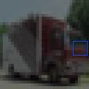
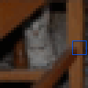

# CIFAR10

<p align="center"></p>

This environment is part of the image classification environments.
Refer to the [image classification environments overview](ImageClassification.md) for a general description of these environments.

|                           |            |
|---------------------------|------------|
| **Environment ID**        | CIFAR10-v0 |
| **Image type**            | RGB        |
| **Number of classes**     | 10         |
| **Number of data points** | 50,000     |
| **Image size**            | 32x32      |
| **Glimpse size**          | 5          |

## Description

In the CIFAR10 environment, the agent's objective is to classify natural images into 10 classes.
The agent has limited visibility, represented by a small movable glimpse that captures partial views of the image.
It must strategically explore different regions of the image to gather enough information for accurate classification.

## Example Usage

```python
import ap_gym

env = ap_gym.make("CIFAR10-v0")

# Or for the vectorized version with 4 environments:
envs = ap_gym.make_vec("CIFAR10-v0", num_envs=4)
```

## Version History

- `v0`: Initial release.

## Variants

| Environment ID   | Description                                                | Preview                                                                  |
|------------------|------------------------------------------------------------|--------------------------------------------------------------------------|
| CIFAR10-train-v0 | Alias for CIFAR10-v0.                                      |            |
| CIFAR10-test-v0  | Uses the test split of CIFAR10 instead of the train split. |  |
