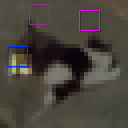

# CIFAR10Loc

<p align="center"></p>

This environment is part of the image localization environments.
Refer to the [image localization environments overview](ImageLocalization) for a general description of these environments.

|                           |               |
|---------------------------|---------------|
| **Environment ID**        | CIFAR10Loc-v0 |
| **Image type**            | RGB           |
| **Number of data points** | 50,000        |
| **Image size**            | 32x32         |
| **Glimpse size**          | 5             |


## Description

In the CIFAR10Loc environment, the agent's objective is to localize a given glimpse in a natural image.
The agent has limited visibility, represented by a small movable glimpse that captures partial views of the image.
It must strategically explore different regions of the image to gather enough information for accurate localization.

## Example Usage

```python
import ap_gym

env = ap_gym.make("CIFAR10Loc-v0")

# Or for the vectorized version with 4 environments:
envs = ap_gym.make_vec("CIFAR10Loc-v0", num_envs=4)
```

## Version History

- `v0`: Initial release.
