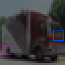
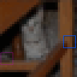

# CIFAR10Loc

<p align="center"></p>

 This environment is part of the Image Localization Environments. Refer to the [Image Localization Environments overview](ImageLocalizationVectorEnv.md) for a general description of these environments.

|                       |                                                                                         |
|-----------------------|-----------------------------------------------------------------------------------------|
| **Environment ID**    | CIFAR10Loc-v0                                                                           |
| **Image type**        | RGB                                                                                     |
| **# data points**     | 50000                                                                                   |
| **Image size**        | 32x32                                                                                   |
| **Glimpse size**      | 5x5                                                                                     |
| **Step limit**        | 16                                                                                      |
| **Image description** | Natural images from the [CIFAR10 dataset](https://www.cs.toronto.edu/~kriz/cifar.html). |

## Description

In the CIFAR10Loc environment, the agent's objective is to localize a given glimpse in a natural image. The agent has limited visibility, represented by a small movable glimpse that captures partial views of the image. It must strategically explore different regions of the image to gather enough information for accurate localization.

## Example Usage

```python

env = ap_gym.make("CIFAR10Loc-v0")

# Or for the vectorized version with 4 environments:
envs = ap_gym.make_vec("CIFAR10Loc-v0", num_envs=4)
```

## Version History

- `v0`: Initial version

## Variants

| Environment ID      | Description                                                    | Preview                                                                          |
|---------------------|----------------------------------------------------------------|----------------------------------------------------------------------------------|
| CIFAR10Loc-train-v0 | Uses the train split of CIFAR10Loc instead of the train split. |  |
| CIFAR10Loc-test-v0  | Uses the test split of CIFAR10Loc instead of the train split.  |    |
