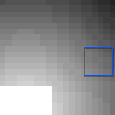
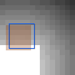
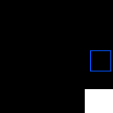

# CircleSquare

<p align="center"></p>

This environment is part of the image classification environments.
Refer to the [image classification environments overview](ImageClassification) for a general description of these environments.

|                           |                                                                   |
|---------------------------|-------------------------------------------------------------------|
| **Environment ID**        | CircleSquare-v0                                                   |
| **Image type**            | Grayscale                                                         |
| **Number of classes**     | 2                                                                 |
| **Number of data points** | 1,568 (for default image size, otherwise $2 \cdot{} W \cdot{} H$) |
| **Image size**            | 28x28                                                             |
| **Glimpse size**          | 5                                                                 |

## Description

In the CircleSquare environment, the agent's objective is to determine whether a given image contains a circle or a square.
The agent has limited visibility, represented by a small movable glimpse that captures partial views of the image.
A visual gradient within the image guides the agent towards the object.

## Example Usage

```python
import ap_gym

env = ap_gym.make("CircleSquare-v0")

# Or for the vectorized version with 4 environments:
envs = ap_gym.make_vec("CircleSquare-v0", num_envs=4)
```

## Version History

- `v0`: Initial release.

## Variants
| Environment ID             | Description                                                                         | Preview                                                                                        |
|----------------------------|-------------------------------------------------------------------------------------|------------------------------------------------------------------------------------------------|
| CircleSquare-s20-v0        | Variant of CircleSquare with a smaller image size of 20 instead of 28.              |                |
| CircleSquare-s15-v0        | Variant of CircleSquare with an even smaller image size of 15 instead of 28.        |                |
| CircleSquare-nograd-v0     | Variant of CircleSquare with no gradient as visual aid.                             |          |
| CircleSquare-s20-nograd-v0 | Variant of CircleSquare-nograd with a smaller image size of 20 instead of 28.       |  |
| CircleSquare-s15-nograd-v0 | Variant of CircleSquare-nograd with an even smaller image size of 15 instead of 28. |  |
