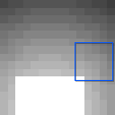
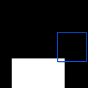

# CircleSquare

<p align="center"></p>

 This environment is part of the Image Classification Environments. Refer to the [Image Classification Environments overview](ImageClassificationVectorEnv.md) for a general description of these environments.

|                       |                                                |
|-----------------------|------------------------------------------------|
| **Environment ID**    | CircleSquare-v0                                |
| **Image type**        | Grayscale                                      |
| **# data points**     | 1568                                           |
| **Image size**        | 28x28                                          |
| **Glimpse size**      | 5x5                                            |
| **Step limit**        | 16                                             |
| **# classes**         | 2                                              |
| **Image description** | An image containing either a circle or square. |

## Description

In the CircleSquare environment, the agent's objective is to determine whether a given image contains a circle or a square. The agent has limited visibility, represented by a small movable glimpse that captures partial views of the image. A visual gradient within the image guides the agent towards the object.

## Example Usage

```python

env = ap_gym.make("CircleSquare-v0")

# Or for the vectorized version with 4 environments:
envs = ap_gym.make_vec("CircleSquare-v0", num_envs=4)
```

## Version History

- `v0`: Initial version

## Variants

| Environment ID             | Description                                                                   | Preview                                                                                        |
|----------------------------|-------------------------------------------------------------------------------|------------------------------------------------------------------------------------------------|
| CircleSquare-s28-v0        | Alias for CircleSquare-v0.                                                    |                |
| CircleSquare-s20-v0        | Variant of CircleSquare with a smaller image size of 20 instead of 28.        |                |
| CircleSquare-s15-v0        | Variant of CircleSquare with an even smaller image size of 15 instead of 28.  |                |
| CircleSquare-nograd-v0     | Variant of CircleSquare with no gradient as visual aid.                       |          |
| CircleSquare-s20-nograd-v0 | Variant of CircleSquare-nograd with a smaller image size of 20 instead of 28. |  |
| CircleSquare-s15-nograd-v0 | Variant of CircleSquare-nograd with a smaller image size of 15 instead of 28. |  |
