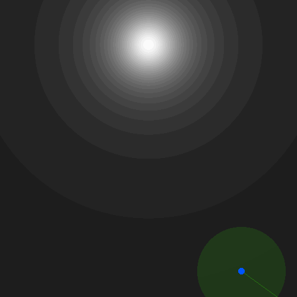

# LightDark

In the LightDark Environment, the agent must estimate its position based on noisy observations, where the noise level depends on the brightness of the surrounding area.
The environment simulates an active regression task where the agent can move to areas with better visibility to improve its position estimation.

This environment is useful for testing active regression models, where the agent must strategically explore its environment to obtain more reliable observations before making predictions.

The visualization shown above has to be interpreted as follows:

- **Blue Dot**: Agent's true position.
- **Green Transparent Circle**: Observation uncertainty (higher in dark regions).
- **Red Dot**: Agent's last prediction.
- **White Background**: Bright regions with low uncertainty.
- **Dark Background**: Dark regions with high uncertainty.

## Properties

<table>
    <tr>
        <td><strong>Environment ID</strong></td>
        <td><code>LightDark-v0</code></td>
    </tr>
    <tr>
        <td><strong>Action Space</strong></td>
        <td><code>Box(-1.0, 1.0, shape=(2,), dtype=np.float32)</code></td>
    </tr>
    <tr>
        <td><strong>Prediction Space</strong></td>
        <td><code>Box(-inf, inf, shape=(2,), dtype=np.float32)</code></td>
    </tr>
    <tr>
        <td><strong>Prediction Target Space</strong></td>
        <td><code>Box(-inf, inf, shape=(2,), dtype=np.float32)</code></td>
    </tr>
    <tr>
        <td><strong>Observation Space</strong></td>
        <td>
            <code>Box(low=-2, high=2, shape=(2,), dtype=np.float32)</code>
        </td>
    </tr>
    <tr>
        <td><strong>Loss Function</strong></td>
        <td>
            <code>ap_gym.MSELossFn()</code>
        </td>
    </tr>
</table>

## Action Space

The action is an `np.ndarray` with shape `(2,)` consisting of continuous values in the range $[-1, 1]$.

- `action[0]`: Horizontal movement.
- `action[1]`: Vertical movement.

Actions are first projected into the unit circle and then scaled by `0.15` per step.
If the agent moves outside the valid region (`[-1,1]`), a large penalty is applied.

## Prediction Space

The prediction is a 2-element `np.ndarray` representing the agent’s estimated position.

## Prediction Target Space

The target is a 2-element `np.ndarray` containing the true position of the agent.

## Observation Space

The observation consists of the episode time as float and a 2-element `np.ndarray` in the range `[-2, 2]`.
The latter represents a noisy estimate of the agent’s true position, where the noise level depends on the brightness of the environment.

- **Brighter areas** → **Low noise** (good observation quality).
- **Darker areas** → **High noise** (poor observation quality).

Both estimates get wrapped in a dictionary with the following keys:

| Key             | Type         | Description                                                                                                      |
|-----------------|--------------|------------------------------------------------------------------------------------------------------------------|
| `"observation"` | `np.ndarray` | 2-element `float32` numpy vector representing the noisy estimate of the agent's position in the range $[-1, 1]$. |
| `"time_step"`   | `float`      | The current time step between 0 and `step_limit` normalized to the range $[-1, 1]$.                              |

## Rewards

The reward at each timestep is the sum of

- A small action regularization equal to $10^{-3} \cdot{} \lVert action\rVert$.
- A boundary penalty of -20, that is applied if the agent moves outside the valid region (`[-1,1]`).
- The negative mean squared error between the agent's prediction and its true position.

## Starting State

The agent'sinitial position is uniformly randomly sampled from the range `[-1, -1]` to `[1, 1]`.

## Episode End

The episode ends with the terminate flag set if one of the following conditions is met:

1. The agent moves out of bounds, receiving a large penalty.
2. The maximum number of steps (`step_limit = 16`) is reached.

## Arguments

| Parameter     | Type                   | Default     | Description                                                 |
|---------------|------------------------|-------------|-------------------------------------------------------------|
| `render_mode` | `Literal["rgb_array"]` | "rgb_array" | Rendering mode (currently only `"rgb_array"` is supported). |
| `step_limit`  | `int`                  | 16          | Maximum steps per episode.                                  |
