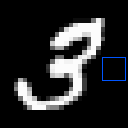

# MNIST

<p align="center"></p>

This environment is part of the image classification environments.
Refer to the [image classification environments overview](ImageClassification.md) for a general description of these environments.

|                           |           |
|---------------------------|-----------|
| **Environment ID**        | MNIST-v0  |
| **Image type**            | Grayscale |
| **Number of classes**     | 10        |
| **Number of data points** | 60,000    |
| **Image size**            | 28x28     |
| **Glimpse size**          | 5         |


## Description

In the MNIST environment, the agent's objective is to classify images of handwritten digits (0-9).
The agent has limited visibility, represented by a small movable glimpse that captures partial views of the image.
It must strategically explore different regions of the image to gather enough information for accurate classification.

## Example Usage

```python
import ap_gym

env = ap_gym.make("MNIST-v0")

# Or for the vectorized version with 4 environments:
envs = ap_gym.make_vec("MNIST-v0", num_envs=4)
```

## Version History

- `v0`: Initial release.

## Variants

| Environment ID | Description                                              | Preview                                                              |
|----------------|----------------------------------------------------------|----------------------------------------------------------------------|
| MNIST-train-v0 | Alias for MNIST-v0.                                      |            |
| MNIST-test-v0  | Uses the test split of MNIST instead of the train split. |  |
