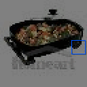

# TinyImageNet

<p align="center"></p>

This environment is part of the image classification environments.
Refer to the [image classification environments overview](ImageClassification.md) for a general description of these environments.

|                           |                 |
|---------------------------|-----------------|
| **Environment ID**        | TinyImageNet-v0 |
| **Image type**            | RGB             |
| **Number of classes**     | 200             |
| **Number of data points** | 100,000         |
| **Image size**            | 64x64           |
| **Glimpse size**          | 10              |


## Description

In the TinyImageNet environment, the agent's objective is to classify natural images into 200 classes.
The agent has limited visibility, represented by a small movable glimpse that captures partial views of the image.
It must strategically explore different regions of the image to gather enough information for accurate classification.

Compared to the CIFAR10 environment, the TinyImageNet dataset contains more classes and higher resolution images.
Also, the glimpse size is larger to account for the higher image resolution.
Consequently, this environment introduces additional complexity compared to CIFAR10.

## Example Usage

```python
import ap_gym

env = ap_gym.make("TinyImageNet-v0")

# Or for the vectorized version with 4 environments:
envs = ap_gym.make_vec("TinyImageNet-v0", num_envs=4)
```

## Version History

- `v0`: Initial release.
