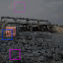

# TinyImageNetLoc

<p align="center"></p>

This environment is part of the image localization environments.
Refer to the [image localization environments overview](ImageLocalization.md) for a general description of these environments.

|                           |                    |
|---------------------------|--------------------|
| **Environment ID**        | TinyImageNetLoc-v0 |
| **Image type**            | RGB                |
| **Number of data points** | 100,000            |
| **Image size**            | 64x64              |
| **Glimpse size**          | 10                 |


## Description

In the TinyImageNetLoc environment, the agent's objective is to localize a given glimpse in a natural image.
The agent has limited visibility, represented by a small movable glimpse that captures partial views of the image.
It must strategically explore different regions of the image to gather enough information for accurate classification.

Compared to the CIFAR10Loc environment, the TinyImageNetLoc dataset contains higher resolution images from more diverse classes.
Also, the glimpse size is larger to account for the higher image resolution.
Consequently, this environment introduces additional complexity compared to CIFAR10.

## Example Usage

```python
import ap_gym

env = ap_gym.make("TinyImageNetLoc-v0")

# Or for the vectorized version with 4 environments:
envs = ap_gym.make_vec("TinyImageNetLoc-v0", num_envs=4)
```

## Version History

- `v0`: Initial release.
