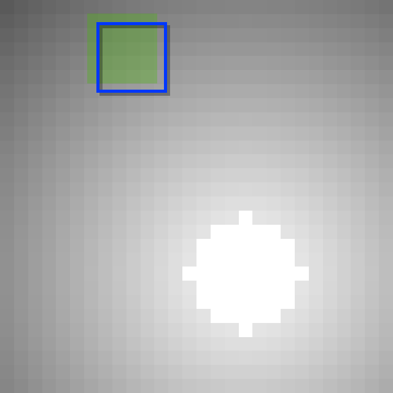

# Circle Square

<p align="center"></p>

This environment is part of the image classification environments.
Refer to the [image classification environments overview](image_classification.md) for a general description of these environments.

|                       |                 |
|-----------------------|-----------------|
| **Environment ID**    | CircleSquare-v0 |
| **Image type**        | Grayscale       |
| **Number of classes** | 2               |

## Description

In the CircleSquare environment, the agent's objective is to determine whether a given image contains a circle or a square. 
The agent has limited visibility, represented by a small movable glimpse that captures partial views of the image. 
A spatial gradient within the image guides the agent's movements, allowing it to strategically explore and collect the necessary information to classify the shape.

At each step, the agent provides both an action, which moves the sensor within the image bounds, and a prediction regarding the object's class. 
The goal is to quickly and accurately classify the shape, incentivizing efficient movements to maximize reward.

## Arguments

```python
import ap_gym

env = ap_gym.make(
    "CircleSquare-v0",
    render_mode="rgb_array",
    show_gradient=True,
    image_shape=(28, 28),
    object_extents=4,
    max_episode_steps=16,
    max_step_length=0.2,
    display_visitation=True,
)
```

## Parameters

| Parameter                    | Type                             | Default     | Description                                                                   |
|------------------------------|----------------------------------|-------------|-------------------------------------------------------------------------------|
| `render_mode`                | `Literal["human", "rgb_array"]`  | "rgb_array" | Rendering mode: "human" or "rgb_array".                                       |
| `show_gradient`              | `bool`                           | True        | Enables a gradient that guides the agent's sensor movement.                   |
| `image_shape`                | `tuple[int, int]`                | (28, 28)    | Shape of the full image generated by the environment.                         |
| `object_extents`             | `int`                            | 8           | Diameter of the circle or side length of the square.                          |
| `max_episode_steps`          | `int \| None`                    | 16          | Maximum steps per episode.                                                    |
| `max_step_length`            | `float`                          | 0.2         | Maximum normalized sensor movement per step relative to the total image size. |
| `display_visitation`         | `bool`                           | True        | Visualize sensor visitation during rendering.                                 |

## Example Usage

```python
import ap_gym

env = ap_gym.make("CircleSquare-v0", render_mode="rgb_array")
obs, info = env.reset(seed=42)
```

## Vectorized Environment

To improve performance, the environment supports vectorization:

```python
import ap_gym

envs = ap_gym.make_vec("CircleSquare-v0", num_envs=4)

print(envs)
# CircleSquareVectorEnv(CircleSquare-v0, num_envs=4)
```

## Version History

- `v0`: Initial release.

