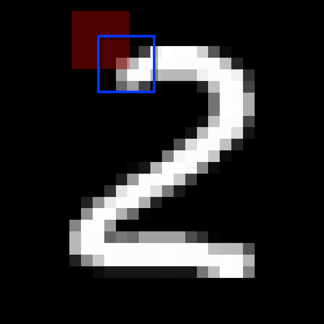

# MNIST



This environment is part of the image classification environments.
Refer to the [image classification environments overview](image_classification.md) for a general description of these environments.

|                       |               |
|-----------------------|---------------|
| **Environment ID**    | MNIST-v0      |
| **Image type**        | Grayscale     |
| **Number of classes** | 10            |

## Description

In the MNIST environment, the agent's objective is to classify images of handwritten digits (0-9). 
The agent has limited visibility, represented by a small movable glimpse that captures partial views of the image. 
It must strategically explore different regions of the image to gather enough information for accurate classification.

At each step, the agent selects an action to move the sensor within the image bounds and makes a prediction of the digit class. 
The goal is to classify the digit as accurately and quickly as possible, promoting efficient information gathering.

## Arguments

```python
import ap_gym

env = ap_gym.make(
    "MNIST-v0",
    render_mode="rgb_array",
    max_episode_steps=16,
    max_step_length=1.0,
)
```

## Parameters

| Parameter                    | Type                  | Default     | Description                                                                   |
|------------------------------|-----------------------|-------------|-------------------------------------------------------------------------------|
| `render_mode`                | `Literal`             | "rgb_array" | Rendering mode: "human" or "rgb_array".                                      |
| `max_episode_steps`          | `int \| None`        | 16          | Maximum steps per episode.                                                    |
| `max_step_length`            | `float`               | 1.0         | Maximum normalized sensor movement per step relative to the total image size. |

## Example Usage

```python
import ap_gym

env = ap_gym.make("MNIST-v0", render_mode="rgb_array")
obs, info = env.reset(seed=42)
```

## Vectorized Environment

To improve performance, the environment supports vectorization:

```python
import ap_gym

envs = ap_gym.make_vec("MNIST-v0", num_envs=4)

print(envs)
# MNISTVectorEnv(MNIST-v0, num_envs=4)
```

## Version History

- `v0`: Initial release.

